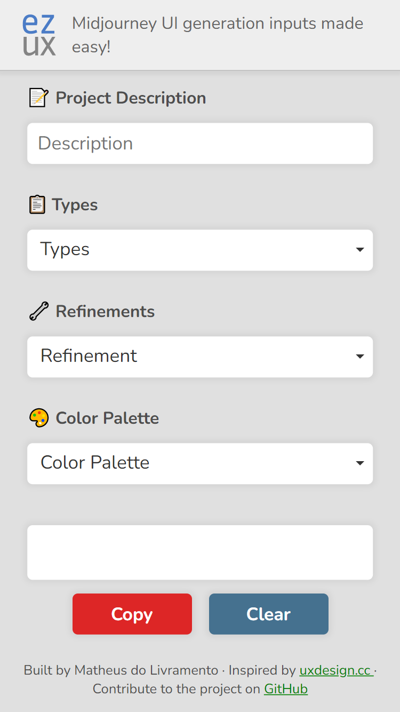
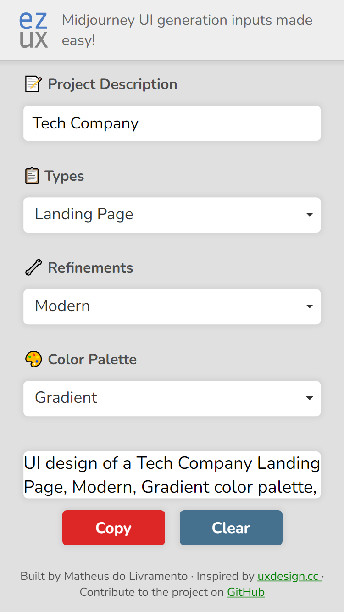
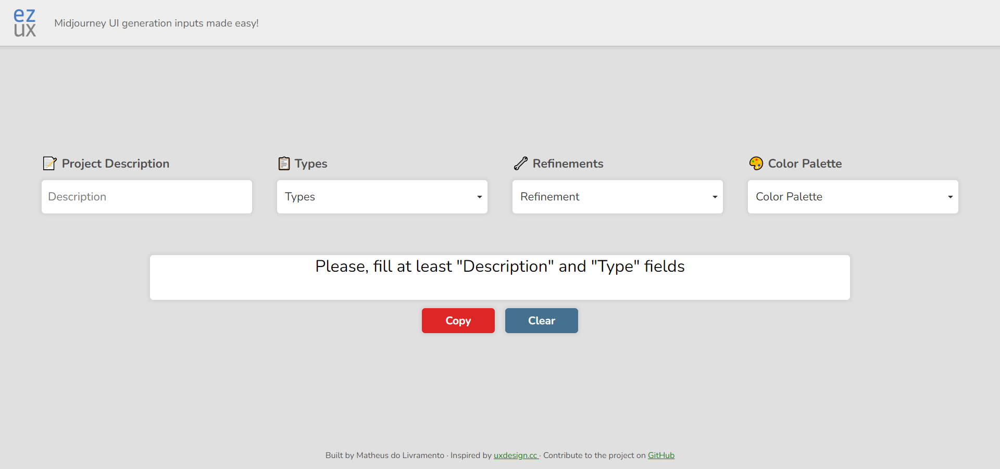
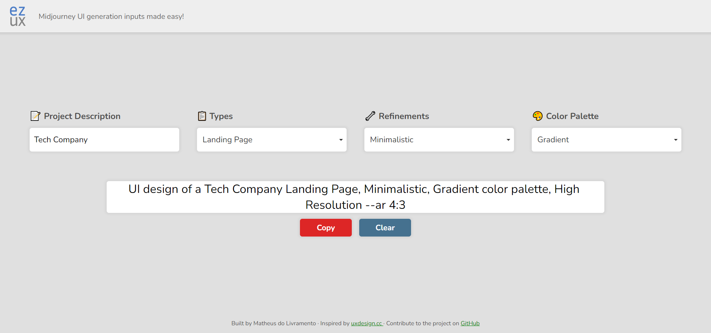

<h1 align="center">ez-ux</h1>

<ul>
    <li><a href="#english-documentation">English documentation</a></li>
    <li><a href="#documentacao-em-portugues">Documentação em português</a></li>
</ul>

<h1 id="english-documentation">English Documentation</h1>

<h2>📜 Table of content</h2>

<ul>
    <li><a href="#about-the-project">About the project</a></li>
    <li><a href="#live-demo">Live demo</a></li>
    <li><a href="#features">Features</a></li>
    <li><a href="#front-end">Front-end</a></li>
    <ul>
        <li><a href="#layout">Layout</a></li>
        <li><a href="#technologies-front">Technologies</a></li>
    </ul>
    <li><a href="#how-to-set-up">How to set up</a></li>
    <li><a href="#author">Author</a></li>
</ul>

<h2 id="about-the-project">💻 About the project</h2>

    ez-ux is a tool to easily build Midjourney prompts for UX, ranging from mobile apps all the way to desktop landing pages. This application also allows the user to refine the prompt and even choose a specific color palette.

<h2 id="live-demo">🌐 Live demo</h2>

    Check out this project running on <a href="https://livramatheus.github.io/ez-ux">GitHub Pages</a>

<h2 id="features">🔎 Features</h2>

<ul>
    <li>Builds Midjourney prompts for UX</li>
    <li>Allows predefined customizations such as "Type", "Refinements" and "Color Palettes"</li>
    <li>Allows the user to edit the final prompt before copying it</li>
</ul>

<h2 id="front-end">Front-end</h2>

    <b>ez-ux</b> was built with HTML, CSS, and JavaScript. Since it was a simple app, I wanted to keep the stack simple as well.

<h3 id="layout">📐 Layout</h3>

<h4>Mobile</h4>

    
    

<h4>Desktop</h4>

    
    

<h3 id="technologies-front">🔨 Technologies</h3>

    The following technologies were used to build ez-ux front-end:

<ul>
    <li>HTML, CSS and Javascript</li>
    <li><a href="https://www.cssscript.com/demo/single-multi-select-vanilla/">Vanilla SelectBox</a></li>
</ul>

<h3 id="how-to-set-up">❓ How to set up</h3>

    Just get a local copy and run it with Live Server.

<h3 id="author">👩‍🦲 Author</h3>

    Developed by <strong>Matheus do Livramento</strong>.

    <a href="https://github.com/livramatheus">GitHub</a> | <a href="https://www.linkedin.com/in/livramatheus">LinkedIn</a> | <a href="https://www.livramento.dev/">Website</a>

<h1 id="documentacao-em-portugues">Documentação em português</h1>
<h2>📜 Tabela de conteúdo</h2>

<ul>
    <li><a href="#about-the-project-br">Sobre o projeto</a></li>
    <li><a href="#live-demo-br">Live demo</a></li>
    <li><a href="#features-br">Funcionalidades</a></li>
    <li><a href="#front-end-br">Front-end</a></li>
    <ul>
        <li><a href="#layout-br">Layout</a></li>
        <li><a href="#technologies-front-br">Tecnologias</a></li>
    </ul>
    <li><a href="#how-to-set-up-br">Como configurar</a></li>
    <li><a href="#autor-br">Autor</a></li>
</ul>

<h2 id="about-the-project-br">💻 Sobre o projeto</h2>

    O ez-ux é uma ferramenta para criar com facilidade prompts de Midjourney para UX, desde aplicativos móveis até páginas para desktop. Este aplicativo também permite que o usuário refine o prompt e até mesmo escolha uma paleta de cores específica.

<h2 id="live-demo-br">🌐 Live demo</h2>

    Veja este projeto rodando no <a href="https://livramatheus.github.io/ez-ux">GitHub Pages</a>

<h2 id="features-br">🔎 Funcionalidades</h2>

<ul>
    <li>Constrói prompts de Midjourney para UX</li>
    <li>Permite personalizações predefinidas como "Tipo", "Refinamentos" e "Paletas de cores"</li>
    <li>Permite que o usuário edite o prompt final antes de copiá-lo</li>
</ul>

<h2 id="front-end-br">Front-end</h2>

    <b>ez-ux</b> foi construído com HTML, CSS e JavaScript. Como se trata de uma aplicação simples, eu também queria manter a stack simples.

<h3 id="layout-br">📐 Layout</h3>

<h4>Mobile</h4>

    
    

<h4>Desktop</h4>

    
    

<h3 id="technologies-front-br">🔨 Tecnologias</h3>

    As seguintes tecnologias foram utilizadas para construir o <em>front-end</em> de ez-ux:

<ul>
    <li>HTML, CSS e Javascript</li>
    <li><a href="https://www.cssscript.com/demo/single-multi-select-vanilla/">Vanilla SelectBox</a></li>
</ul>

<h3 id="how-to-set-up-br">❓ Como configurar</h3>

    Basta obter uma cópia local e executá-la com o Live Server.

<h4 id="client-side-">Client-side:</h4>

<h3 id="autor-br">👩‍🦲 Autor</h3>

    Desenvolvido por <strong>Matheus do Livramento</strong>.

    <a href="https://github.com/livramatheus">GitHub</a> | <a href="https://www.linkedin.com/in/livramatheus">LinkedIn</a> | <a href="https://www.livramento.dev/">Website</a>

